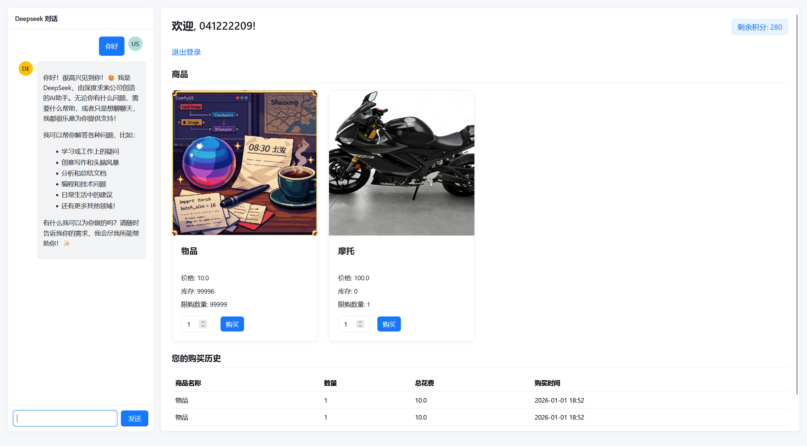
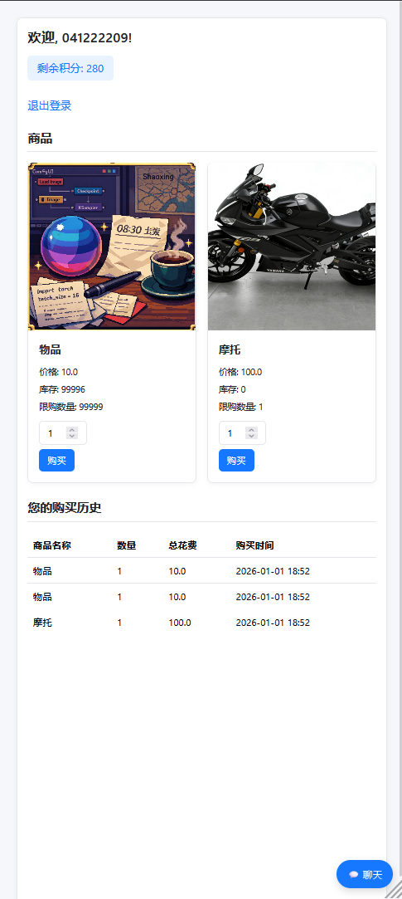

# StudentSupportPointExchangeSystem
A dedicated platform for managing financial aid points, enabling students in need to redeem essential academic and daily living supplies.
---

# 爱心屋积分兑换系统 (StudentSupportPointExchangeSystem)

一个专为学生资助管理设计的积分兑换平台，帮助有需要的学生通过积分（爱心币）兑换学习和日常生活必需品。

## 系统截图
| 管理员后台界面 |
|----------------|
|  |

| 带聊天的商品页面 | 商品页面 |
|------------------|----------|
|  |  |

## 功能特点

### 核心功能
- **用户管理**：支持学生用户和管理员角色，实现用户登录、信息管理
- **商品管理**：管理员可添加、编辑、删除商品，包括名称、图片、价格、库存和兑换限制
- **积分系统**：管理学生的爱心币数量，记录积分变动
- **兑换功能**：学生可使用爱心币兑换商品，系统自动扣减积分并更新库存
- **购买记录**：记录所有兑换交易，便于查询和管理
- **Excel导入**：支持从Excel批量导入学生信息，默认密码为学号

### 辅助功能
- **帮助中心**：提供详细的使用说明、视频教程和联系信息
- **响应式设计**：适配不同设备的浏览需求
- **中文界面**：全中文操作界面，方便用户使用

## 技术栈

### 后端
- **Flask**：轻量级Python Web框架
- **SQLAlchemy**：ORM框架，简化数据库操作
- **SQLite**：轻量级关系型数据库
- **openpyxl**：Excel文件处理库

### 前端
- **HTML5/CSS3**：页面结构和样式
- **JavaScript**：客户端交互逻辑
- **Jinja2**：模板引擎，实现动态页面

## 安装和运行

### 环境要求
- Python 3.7+（推荐3.12.10）
- pip 包管理工具

### 安装步骤

1. **克隆或下载项目**
   ```bash
   git clone git@github.com:JyzjYzjyZ/StudentSupportPointExchangeSystem.git
   ```

2. **创建虚拟环境**
   ```bash
   python -m venv .venv
   ```

3. **激活虚拟环境**
   - Windows:
     ```bash
     .venv\Scripts\activate
     ```
   - macOS/Linux:
     ```bash
     source .venv/bin/activate
     ```

4. **安装依赖**
   ```bash
   pip install flask flask-sqlalchemy openpyxl
   ```

5. **初始化数据库**
   ```bash
   python
   ```
   在Python交互式环境中执行：
   ```python
   from app import app, db
   with app.app_context():
       db.create_all()
   exit()
   ```

6. **运行应用**
   ```bash
   python app.py
   ```

7. **访问应用**
   在浏览器中输入：`http://localhost:5000`

## 项目结构

```
爱心屋大创 5/
├── app.py                # 应用主程序
├── templates/            # HTML模板文件
│   ├── admin.html        # 管理员界面
│   ├── login.html        # 登录界面
│   ├── shop.html         # 商品页面
│   ├── purchase_success.html  # 购买成功页面
│   ├── help.html         # 帮助页面
│   └── deepseek.html     # 聊天对话框页面
├── static/               # 静态资源文件
│   ├── images/           # 商品图片
│   ├── styles.css        # 样式文件
│   ├── scripts.js        # JavaScript文件
│   └── help.mp4          # 帮助视频
├── shop.db               # SQLite数据库文件
└── README.md             # 项目说明文档
```

## 使用说明

### 学生用户
1. 使用学号和密码登录系统
2. 浏览商品列表，查看商品详情
3. 使用爱心币兑换需要的商品
4. 查看兑换记录

### 管理员操作
1. 使用管理员账号登录（默认：name: 111, password: 111）
2. **用户管理**：查看、编辑学生信息，批量导入学生数据
3. **商品管理**：添加、编辑、删除商品信息
4. **整理表格**：规范化Excel表格格式
5. **使用须知**：查看帮助文档和视频教程

### Excel导入说明
1. 点击"整理表格"规范化人员表格Excel
2. 点击"用户管理" -> "导入excel"导入规范化的表格
3. 导入的学生默认密码为学号

## 管理员信息

- 默认管理员账号：`111`
- 默认管理员密码：`111`

## 版本信息

- 当前版本：26.1.2

## 贡献者

- 作者：金彦泽，谭佳良
- 论文作者：金彦泽，张明昌
- 特别鸣谢：项阳，赵天豪

## 联系方式

如有疑问，请联系作者微信咨询。

## 注意事项

- 若要清空数据库，可以直接删除"shop.db"文件
- 系统会自动备份数据，请定期检查数据库文件
- 使用过程中遇到问题，请参考帮助中心或联系管理员
